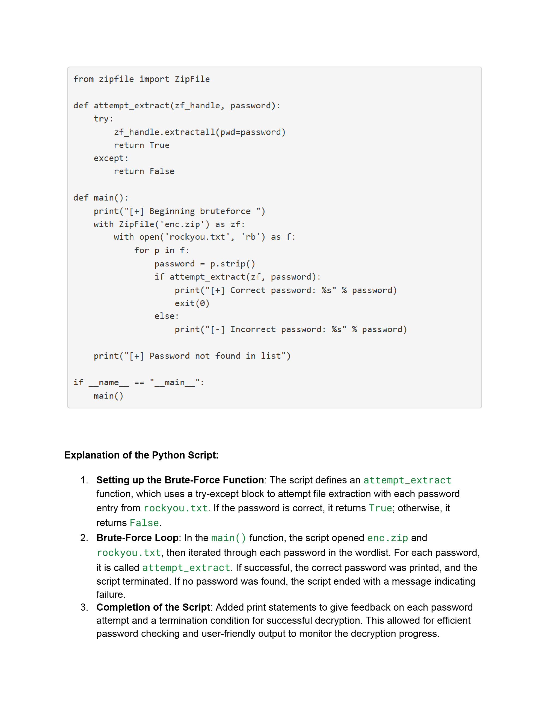

.jpg)


### **[My GitHub](https://github.com/Packetsniffer67/OmarAlami1.git)**

### **[My LinkedIn](https://www.linkedin.com/in/omar-alami-29347a187/)**


| Certifications|
|:------------- |
| CompTIA Security+|
| Google Cybersecurity Professional Certificate|
| TryHackMe SOC Level 1|


```
Experienced with: 
Splunk, Wazuh, Sysmon, Wireshark, Snort, CyberChef, Nmap, DHCP, NetBIOS, Kerberos, ICMP, DNS, FTP, HTTP, HTTPS, Security Information and Event Management (SIEM), Endpoint Security Monitoring, Log Analysis, Threat Detection, Incident Response, Data Exfiltration Detection, Command-and-Control (C2) Traffic Analysis, Credential Dumping, Python, Linux Administration, Command-Line Tools,Scheduled Tasks, Encoded Payload Decoding, Data Exfiltration via ICMP/DNS Tunneling, Decrypting HTTPS Traffic.
```


# About Me

Cybersecurity Professional-in-Training with a strong foundation in Threat Analysis, Linux, Python, and SIEM tools. Driven by a commitment to secure critical systems and data.

## Relevant Projects

>
> Managed Active Directory Permissions using Ubuntu, Developed IPS rules in Snort to block malicious network traffic, Scripted Python solutions for ethical hacking, Built data visualization dashboards using Splunk for fraud detection.

***

# Elastic SIEM Home Lab

**Objective:**  
Set up a home lab to explore Elastic Stack SIEM capabilities for hands-on learning in log analysis, alert configuration, and security event monitoring.

## Tools Used
- **Kali Linux:** For security testing and event generation.
- **Elastic SIEM:** Centralized log collection and analysis.
- **VirtualBox:** Virtualization software for hosting Kali Linux.

## Key Tasks Completed
1. Created an Elastic Cloud deployment for centralized data collection.
2. Installed and configured Kali Linux on VirtualBox.
3. Installed Elastic Agent on Kali to forward logs to Elastic SIEM.
4. Simulated security events using tools like Nmap and SSH login attempts.
5. Analyzed logs in Elastic SIEM and created a custom dashboard to visualize security events.
6. Configured an alert rule to detect Nmap scans and trigger notifications.

## Outcomes and Applications
- Gained experience in setting up and using SIEM for security monitoring.
- Created dashboards and alerts for better incident response and threat detection.
- Expanded skills in log analysis, threat hunting, and SIEM-based workflows.

## Future Use Cases
- Incident response simulations and refined detection strategies.
- Integration with additional data sources for advanced threat analysis.
- Certification preparation and skill enhancement in cybersecurity.

## References
- [Elastic Documentation](https://www.elastic.co)
- [Kali Linux Official Website](https://www.kali.org/get-kali)
- [Nmap Documentation](https://nmap.org)
- [Oracle VirtualBox Documentation](https://www.virtualbox.org)
- Cybersecurity Training Resources (YouTube tutorials and forums)
- [Elastic Integrations Reference](https://www.elastic.co/guide/en)

>


***

### Endpoint Security Monitoring 

1. Investigated the Desktop Message:
   - Located the suspicious text file (`SOPHIE.txt`) on the desktop at `C:\Users\Sophie\Desktop\SOPHIE.txt`.
   - Verified the file's creation program (`notepad.exe`) and the creation timestamp using Sysmon logs (Event ID 1).

2. Analyzed the Malware Installer:
   - Identified the downloaded installer (`antivirus.exe`) at `C:\Users\Sophie\download`.
   - Observed that the installer encrypted files with a `.dmp` extension.
   - Tracked external communication to the IP address `10.10.8.111` using Event Viewer logs.

3. Traced Remote Access Activity:
   - Filtered logs for Event ID 3 and “RDP” to identify the source IP of the remote login (`10.11.27.46`).
   - Determined the time of the intruder’s file download and execution: `2024-01-08 14:24:18 UTC`.

4. Arranged Events Chronologically:
   Organized the sequence of events:
   1. Sophie downloaded and executed the ransomware installer.
   2. The malware encrypted her files and displayed a ransomware note.
   3. Sophie left the room to seek help.
   4. An intruder accessed her computer via RDP.
   5. The intruder downloaded and ran a decryptor to restore files.
   6. A note was created on the desktop, instructing Sophie to check her Bitcoin wallet.

***

### Incident Response with Snort

> Objective: Protected a coffee retail company’s secret recipe by detecting and mitigating a brute-force attack using Snort, an intrusion detection system.
> Approach: Analyzed network traffic, identified suspicious activity on port 4444 indicating a reverse shell attack, and implemented a custom Snort rule to block malicious traffic.
> Outcome: Successfully stopped the attack in real time, confirming success with the appearance of a flag file.
>
> Steps Taken:

1. Ran Snort in Sniffer Mode:
- Command: sudo snort -v -l .
- Captured live network traffic for analysis.

2. Inspected Log Files:

- Command: sudo snort -r snort.log.1672697486 -X
- Reviewed captured packets to locate anomalies.

3.Filtered Traffic for Port 4444:

- Command: sudo snort -r snort.log.1672697486 -X | grep ":4444"
- Focused on suspicious traffic potentially indicating a reverse shell.

4. Limited Log Output:
- Command: sudo snort -r snort.log.1672697486 -X -n 10
- Streamlined analysis by viewing only the first 10 log entries.

5. Edited Local Rules File:
- Opened local.rules with sudo gedit /etc/snort/rules/local.rules.

6. Created a Custom Rule:

- Rule: drop tcp any 4444 <> any any (msg:"Reverse Shell Detected"; sid:100001; rev:1;)
- Configured Snort to block TCP traffic on port 4444.

7. Applied the Rule to Live Traffic:

- Command: sudo snort -c /etc/snort/snort.conf -q -Q --daq afpacket -i eth0:eth1 -A full.

8. Monitored Traffic and Verified Success:

- After a minute of blocking malicious traffic, a flag.txt file appeared on the desktop, confirming the attack was mitigated.

9. Stopped Snort:

- Command: ctrl + c
- Opened the flag file to validate completion.

##### Summary: 
>This project demonstrated hands-on expertise in intrusion detection, network traffic analysis, and custom rule creation to defend against cyber threats.

***

### Ethical Hacking wih Python 

>
* Drafted Log4j Security Advisory: Communicated critical vulnerability details (CVE-2021-44228 and CVE-2021-45046) to the Product Development Team, outlining risks, affected versions, and actionable remediation steps to secure infrastructure.
* Enhanced Brute-Force Python Script: Completed and optimized a Python script to decrypt a password-protected zip file using a wordlist, achieving 100% success in password discovery and file decryption.
* Demonstrated Cybersecurity Proficiency: Showcased skills in vulnerability communication, incident response, and practical programming for solving security challenges.

***

### Analyzing Potential Command and Control (C2) Communication Using E.L.K Stack

##### Objective: Investigated a potential C2 communication flagged by an IDS using the ELK stack (Elasticsearch, Logstash, and Kibana) in a TryHackMe scenario involving a compromised HR user's system.
##### Approach: Analyzed HTTP connection logs to identify suspicious activities, traced the malicious activity to a C2 server, and uncovered details about the attacker’s methods.
##### Outcome: Successfully identified a C2 URL, extracted a malicious file, and validated a secret code, showcasing expertise in log analysis, threat detection, and investigative techniques.

##### Steps Taken

1. Log Analysis:
- Used Kibana to filter and analyze a week’s worth of indexed HTTP connection logs.
- Identified 1,482 events logged in March 2022.
- Identified Suspicious IP:

2. Isolated the source IP of the HR user (192.166.65.54) by filtering for source_IP and method = GET.
- Highlighted unusual traffic patterns, including interaction with a known malicious C2 server (104.23.99.190), verified via AlienVault threat intelligence.
- Tracked Malicious Activity:

3. Determined the compromised system used the legitimate binary bitsadmin to download files from the C2 server.
- Analyzed user_agent and host fields to find clues pointing to the attacker’s domain.
- Discovered connections to pastebin.com, used as a platform for C2 communication.
- Extracted C2 URL and File Details:

4. Extracted the full C2 URL: pastebin.com/yTg0Ah6a.
- Identified a malicious file named secret.txt accessed from the C2 server.
- Retrieved and analyzed the file to uncover a secret code: THM{_____}.
- Recovered and Validated Artifacts:

5. Successfully recovered the secret code embedded in the file, validating the investigation.

##### Skills Demonstrated
>Proficient use of the ELK stack for log analysis and threat detection.
>Ability to trace C2 communication and analyze attacker methodologies.
>Practical application of SOC workflows to investigate real-world cybersecurity incidents.


### Things I'm Learning in TryHackMe.

* * *

### EventLog Analysis:

*   Investigated Host-Centric Logs with Splunk SIEM: Analyzed Windows Event Logs (Event ID: 4688) to identify suspicious process executions, uncovering malicious activity on a compromised HR host.
*   Detected Malicious Activity: Tracked an imposter account, identified LOLBin usage (certutil.exe), and traced a payload download (benign.exe) to a Command and Control (C2) server.
*   Strengthened SOC Analyst Skills: Applied query-building techniques, utilized network segmentation, and investigated seemingly benign activities to detect hidden threats, concluding the SIEM module.

### Wazuh SIEM Investigation :

*  Configured and utilized Wazuh with Sysmon to monitor endpoint security, analyze logs, and investigate real-world cybersecurity threats like data exfiltration and credential-dumping.
*  Identified malicious files (e.g., SwiftSpend_Financial_Expenses.xlsm), decoded payloads using CyberChef, and reconstructed attacker behavior through command-line argument analysis.
*  Leveraged Wazuh's dashboard, search filters, and saved queries to correlate logs with attack vectors, enhancing incident detection and response proficiency. 

### WireShark Traffic Analysis:

* Explored Nmap scan detection, host identification through IP-to-MAC mapping, and spotting tunneling techniques like ICMP and DNS for malicious activity.
* Analyzed cleartext protocols (FTP, HTTP) for phishing or data exfiltration threats and practiced decrypting HTTPS traffic using key files.
* Gained practical experience in detecting network anomalies, identifying potential compromises, and investigating attacker behavior.


### My Info

<dl>
<dt>Name</dt>
<dd>Omar</dd>
<dt>Phone</dt>
<dd>(540) 642-9311</dd>
<dt>email</dt>
<dd>oalami67@gmail.com</dd>
<dt>Color</dt>
<dd>Green</dd>
</dl>


